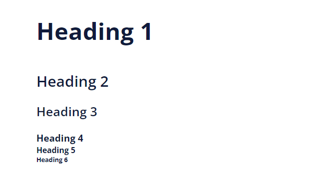
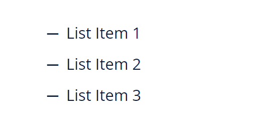
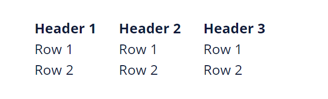
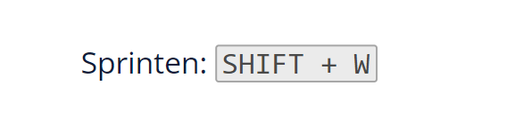

# Task Force Hellcat Wiki written in SvelteKit

[](https://wiki.taskforcehellcat.de)
[](https://discord.taskforcehellcat.de/)

## Adding new pages

To add a new wiki page, just add a `[name].svx` file in `/src/content` where `[name]` is the short name of the page:

```
|__ src
    |__ content
        |__ article-name.svx
```

The name should not contain any special characters except for `-` and `_`, should be lower case & **should not contain any spaces** as the name is used to generate the URL.

The top of the file should contain the following metadata:

```
---
title:      [Full Page Title]
date:       [Date of last edit in 'YYYY-MM-DD' format]
nav_index:  [Order of the page in the navigation]
---
```

## Formatting Pages

Pages are written in Markdown and are saved as `.svx` files. The pages are then compiled into HTML using [SvelteKit](https://kit.svelte.dev/).

---

### Adding headings

Headings are created by using `#` at the beginning of a line. The more `#` are used, the smaller the heading will be.

```
## Heading 2

### Heading 3

#### Heading 4

##### Heading 5
```

They will look like this when rendered:



The title does not need to be added to the page as it is automatically generated from the page name set at the top of the file (see [Adding new pages](##Adding-new-pages)).

---

### Adding lists

Lists can be created by using `-` at the beginning of a line.

```markdown
- List Item 1
- List Item 2
- List Item 3
```

They will look like this when rendered:



---

### Adding images

Images can be added by using the following syntax:

Images are saved in `/src/lib/images/[group]` where `[group]` is the name of the group the image belongs to, like 'ausbildung' or 'streitkraefte'.

```html
<script>
  import alphabet from '$lib/images/funketikette/alphabet.png';
</script>
```

They can then be referenced using the variable name:

```markdown

```

The part inside the square brackets is the alt text that is displayed if the image cannot be loaded or if the user is using a screen reader.
It should be a short description of the image.

To use an **external** image, just use the URL instead of the variable name:

```markdown

```

### Adding Slideshows

For slideshows you can use the slideshow component:

```html
<script>
  import Slideshow from '$lib/slideshow/Slideshow.svelte';
</script>
```

It takes two arrays as properties, `images` containing the paths to the images to be displayed, `captions` their respective captions. You can use external images as well.

A complete example might look like this:

```svelte
<script lang="ts">
  import Slideshow from '$lib/slideshow/Slideshow.svelte';

  import leopard from '$lib/path/to/leopard.jpg';
</script>

<Slideshow
  images={[leopard, 'https://www.hoster.com/challenger.jpg']}
  captions={['Das ist der Leopard', 'Das ist der Challenger']}
/>
```

---

### Creating links

To link to another wiki page, use the following syntax:

```markdown
[Sanitäter](/sanitaetsdienst/sanitaeter)
```

The square brackets contain the text that is displayed and the round brackets contain the path to the page.

To link to a section on the same page, append `#` and the section name to the path.

```markdown
[Sanitäter](/sanitaetsdienst/sanitaeter#ausrüstung)
```

To link to an external page, use the following syntax:

```markdown
[Wikipedia](https://wikipedia.org)
```

---

### Creating tooltips

Tooltips can be added by using `<Tooltip>` tags:

```html
<Tooltip text="Main Battle Tank">MBT</Tooltip>
```

They will look like this when hovered over:


---

### Creating example boxes

Example boxes contain example text that can be used to further explain a concept and can be clicked to expand and collapse.

They can be added by using `<ExampleBox>` tags:

```html
<ExampleBox>I'm an example box!</ExampleBox>
```

They will look like this when rendered:


---

### Creating tables

Tables can be created by using the following syntax:

```markdown
| Header 1 | Header 2 | Header 3 |
| -------- | -------- | -------- |
| Row 1    | Row 1    | Row 1    |
| Row 2    | Row 2    | Row 2    |
```

They will look like this when rendered:



---

### Displaying keyboard keys

Keyboard keys can be displayed by using the custom `<Keys>` tag:

```html
Sprinten: <Keys keys="SHIFT,W" />
```

They will look like this when rendered:



**Important:** Use american english key identifiers and the keyboard layout under windows. They will get translated accordingly.
For a list of the mappings used see `src/lib/wikitools/Keys.svelte`, `mapDeEn` and `mapWinMac` respectively.
Be sure to use the `Keys` component instead of the `<kbd>` tag if your key needs to be mapped!

---

### Adding YouTube videos

YouTube videos can be embedded by using the following syntax:

```html
<iframe
  width="560"
  height="315"
  src="https://www.youtube.com/embed/7Tuhg0tyzT4"
  title="YouTube video player"
  frameborder="0"
  allow="accelerometer; autoplay; clipboard-write; encrypted-media; gyroscope; picture-in-picture; web-share"
  allowfullscreen
></iframe>
```

This embed code can be generated by clicking the share button on a YouTube video and selecting the embed option.

## Mass-formatting files

To mass-format all files in the repository, run the following command:

```bash
npm run format
```

This will format all files using [Prettier](https://prettier.io/).
